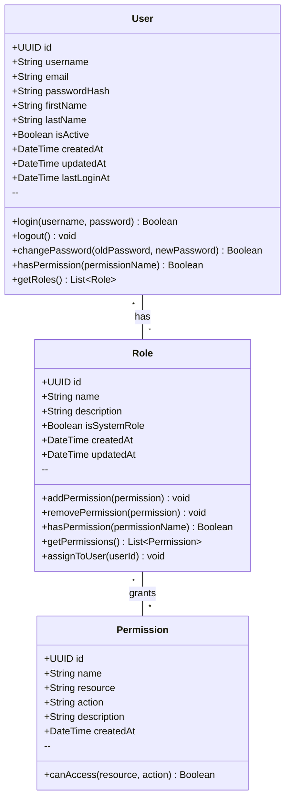
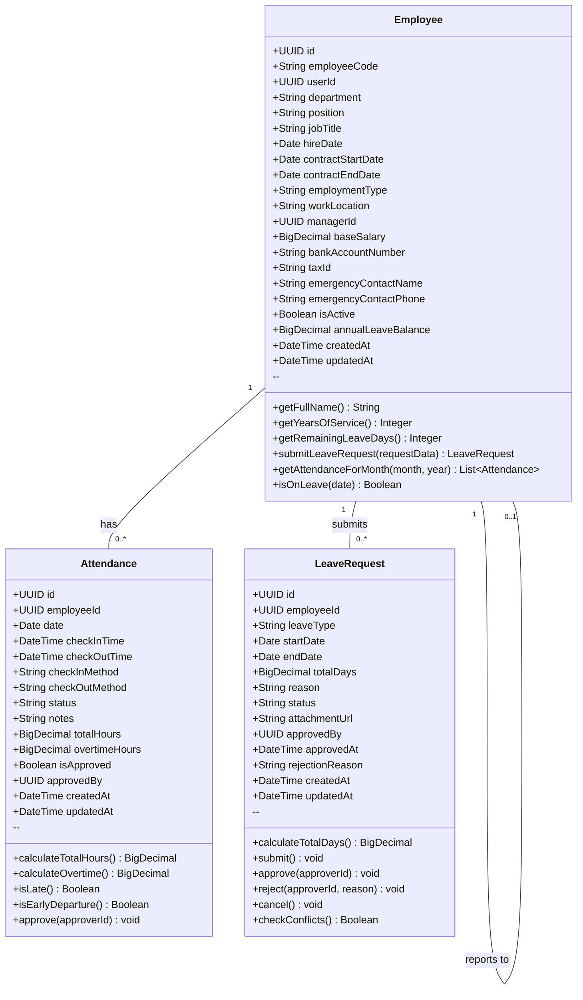

# Class Diagrams Documentation

## Auth Module

**File:** `architecture/diagrams/class/auth.mermaid`

### Classes

| Class | Description |
|-------|-------------|
| **User** | Represents a system user who can authenticate and access the ERP system |
| **Role** | Defines a collection of permissions that can be assigned to users |
| **Permission** | Defines a specific action that can be performed on a resource |

### Diagram

### Relationships

- **User ↔ Role**: Many-to-Many. A user can have multiple roles. A role can be assigned to multiple users.
- **Role ↔ Permission**: Many-to-Many. A role can have multiple permissions. A permission can belong to multiple roles.

### Key Attributes

| Class | Attribute | Description |
|-------|-----------|-------------|
| User | `username`, `email`, `passwordHash` | Authentication credentials |
| User | `firstName`, `lastName` | Personal information |
| User | `isActive` | Account status (active/inactive) |
| Role | `name`, `description` | Role identification |
| Role | `isSystemRole` | Prevents modification of system-critical roles |
| Permission | `resource`, `action` | Defines access rights (e.g., `employee:create`) |

### Key Methods

| Class | Method | Description |
|-------|--------|-------------|
| User | `login()` | Authenticates user with credentials |
| User | `hasPermission()` | Checks if user has a specific permission |
| Role | `addPermission()` | Grants a permission to the role |
| Role | `assignToUser()` | Assigns this role to a user |
| Permission | `canAccess()` | Checks if permission matches resource and action |

---

## HR Module

**File:** `architecture/diagrams/class/hr.mermaid`

### Classes

| Class | Description |
|-------|-------------|
| **Employee** | Stores employment information for staff members |
| **Attendance** | Records daily check-in and check-out activity |
| **LeaveRequest** | Manages employee leave applications and approval workflow |

### Diagram

### Relationships

- **Employee → Attendance**: One-to-Many. One employee can have multiple attendance records (one per working day).
- **Employee → LeaveRequest**: One-to-Many. One employee can submit multiple leave requests over time.
- **Employee → Employee**: Self-Reference. Each employee reports to a manager who is also an employee.

### Key Attributes

| Class | Attribute | Description |
|-------|-----------|-------------|
| Employee | `employeeCode` | Unique employee identifier |
| Employee | `userId` | Links to Auth User account |
| Employee | `department`, `position` | Employment details |
| Employee | `managerId` | Reference to employee's manager |
| Employee | `annualLeaveBalance` | Remaining annual leave days |
| Employee | `isActive` | Employment status |
| Attendance | `checkInTime`, `checkOutTime` | Clock-in and clock-out timestamps |
| Attendance | `status` | PRESENT, ABSENT, LATE, HALF_DAY |
| Attendance | `totalHours`, `overtimeHours` | Calculated working hours |
| LeaveRequest | `leaveType` | ANNUAL, SICK, UNPAID |
| LeaveRequest | `startDate`, `endDate` | Leave period |
| LeaveRequest | `status` | PENDING, APPROVED, REJECTED, CANCELLED |

### Key Methods

| Class | Method | Description |
|-------|--------|-------------|
| Employee | `getYearsOfService()` | Calculates tenure based on hire date |
| Employee | `getRemainingLeaveDays()` | Returns current annual leave balance |
| Employee | `submitLeaveRequest()` | Creates a new leave request |
| Attendance | `calculateTotalHours()` | Computes hours worked from check-in/out |
| Attendance | `isLate()` | Checks if check-in time exceeds company policy |
| Attendance | `approve()` | Approves an attendance record |
| LeaveRequest | `calculateTotalDays()` | Calculates number of days between start and end date |
| LeaveRequest | `checkConflicts()` | Checks for overlapping leave requests |
| LeaveRequest | `approve()` / `reject()` | Updates request status |

---

## Cross-Module Integration

| Auth Module | HR Module | Integration |
|-------------|-----------|-------------|
| `User.id` | `Employee.userId` | Links employee records to user accounts |
| `Permission` with `leave:approve` | LeaveRequest approval | Managers need proper permissions to approve requests |
| `Role` with `MANAGER` | `Employee.managerId` | Users with manager role can act as approvers |

---

## File Locations

| Module | Diagram Path |
|--------|--------------|
| Auth Module | `architecture/diagrams/class/auth.mermaid` |
| HR Module | `architecture/diagrams/class/hr.mermaid`