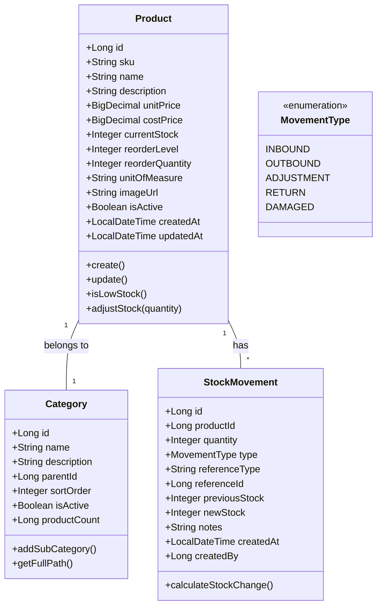

```mermaid
classDiagram
    class Product {
        +Long id
        +String sku
        +String name
        +String description
        +BigDecimal unitPrice
        +BigDecimal costPrice
        +Integer currentStock
        +Integer reorderLevel
        +Integer reorderQuantity
        +String unitOfMeasure
        +String imageUrl
        +Boolean isActive
        +LocalDateTime createdAt
        +LocalDateTime updatedAt
        +create()
        +update()
        +isLowStock()
        +adjustStock(quantity)
    }
    
    class Category {
        +Long id
        +String name
        +String description
        +Long parentId
        +Integer sortOrder
        +Boolean isActive
        +Long productCount
        +addSubCategory()
        +getFullPath()
    }
    
    class StockMovement {
        +Long id
        +Long productId
        +Integer quantity
        +MovementType type
        +String referenceType
        +Long referenceId
        +Integer previousStock
        +Integer newStock
        +String notes
        +LocalDateTime createdAt
        +Long createdBy
        +calculateStockChange()
    }
    
    class MovementType {
        <<enumeration>>
        INBOUND
        OUTBOUND
        ADJUSTMENT
        RETURN
        DAMAGED
    }
    
    Product "1" -- "1" Category : belongs to
    Product "1" -- "*" StockMovement : has
```
