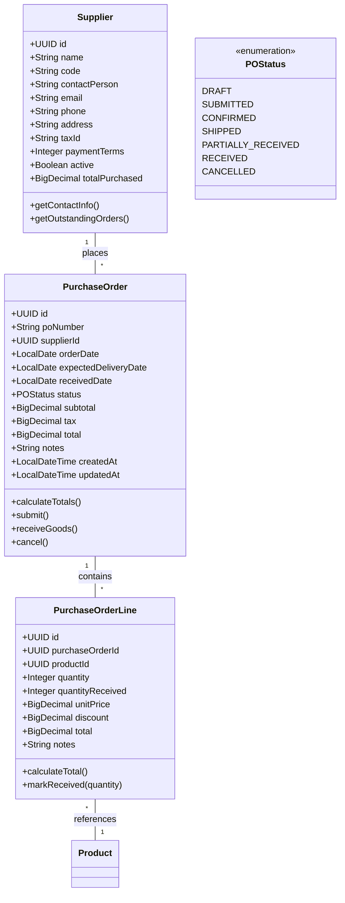

```mermaid
classDiagram
    class PurchaseOrder {
        +UUID id
        +String poNumber
        +UUID supplierId
        +LocalDate orderDate
        +LocalDate expectedDeliveryDate
        +LocalDate receivedDate
        +POStatus status
        +BigDecimal subtotal
        +BigDecimal tax
        +BigDecimal total
        +String notes
        +LocalDateTime createdAt
        +LocalDateTime updatedAt
        +calculateTotals()
        +submit()
        +receiveGoods()
        +cancel()
    }
    
    class PurchaseOrderLine {
        +UUID id
        +UUID purchaseOrderId
        +UUID productId
        +Integer quantity
        +Integer quantityReceived
        +BigDecimal unitPrice
        +BigDecimal discount
        +BigDecimal total
        +String notes
        +calculateTotal()
        +markReceived(quantity)
    }
    
    class Supplier {
        +UUID id
        +String name
        +String code
        +String contactPerson
        +String email
        +String phone
        +String address
        +String taxId
        +Integer paymentTerms
        +Boolean active
        +BigDecimal totalPurchased
        +getContactInfo()
        +getOutstandingOrders()
    }
    
    class POStatus {
        <<enumeration>>
        DRAFT
        SUBMITTED
        CONFIRMED
        SHIPPED
        PARTIALLY_RECEIVED
        RECEIVED
        CANCELLED
    }
    
    PurchaseOrder "1" -- "*" PurchaseOrderLine : contains
    Supplier "1" -- "*" PurchaseOrder : places
    PurchaseOrderLine "*" -- "1" Product : references
```